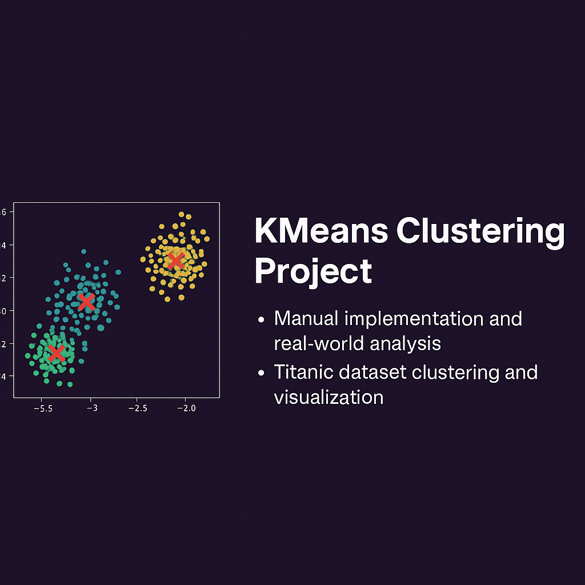
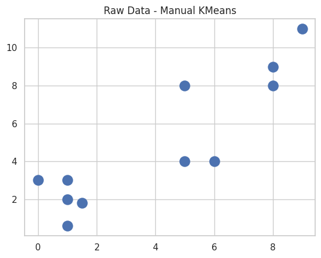
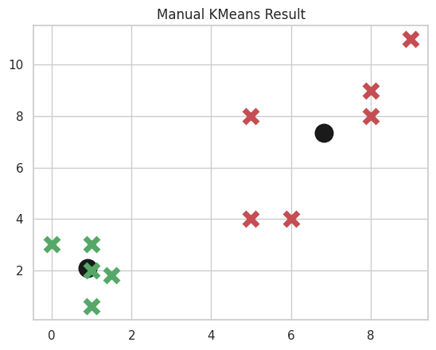
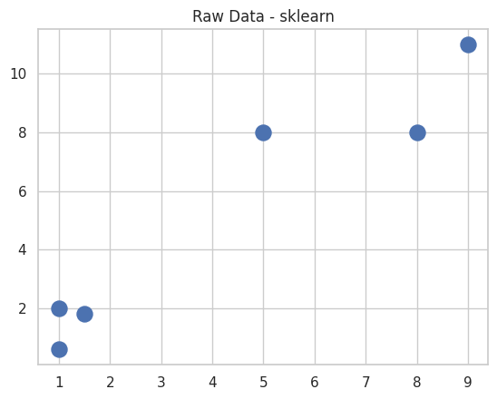
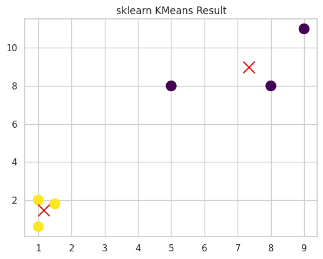
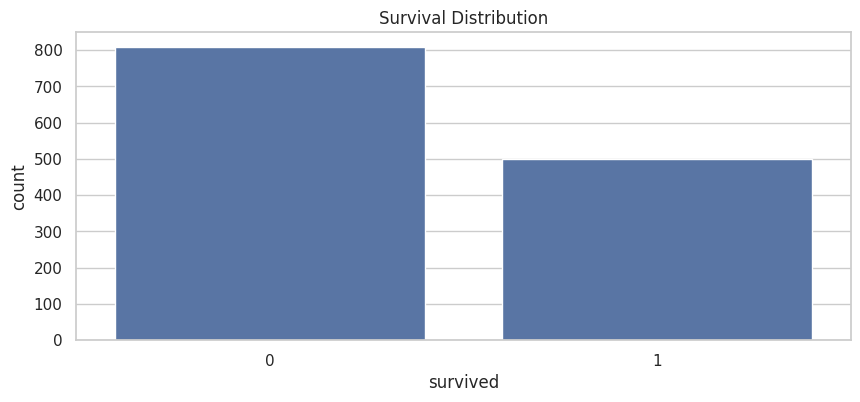
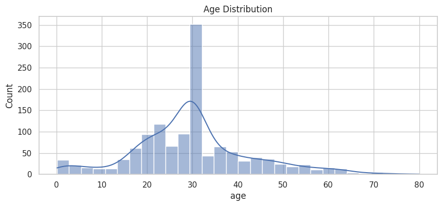
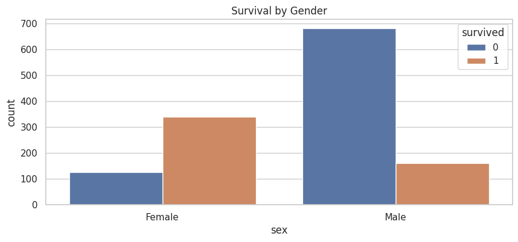
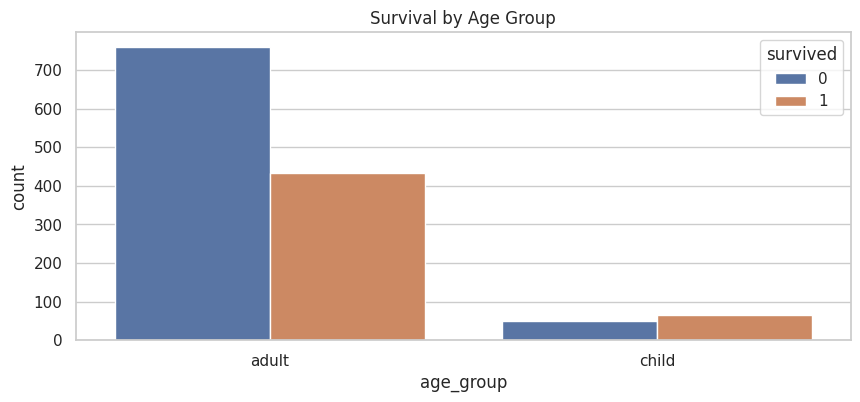

# KMeans Clustering Project




## 📌 Overview

This project explores clustering using the KMeans algorithm through:
- Manual implementation using NumPy
- Using scikit-learn on synthetic data
- Titanic dataset analysis with real-world clustering insights

## 📁 Structure

```
KMeans-Clustering-Project/
├── data/                  # Titanic dataset
├── src/                   # Main Python code
├── images/                # Visual assets
├── analysis_report.txt    # Key findings from Titanic dataset
├── requirements.txt
├── README.md
├── LICENSE
└── .gitignore
```

## 🚀 How to Run

```bash
pip install -r requirements.txt
python src/kmeans_clustering_project.py
```

Make sure `titanic.xls` is inside the `data/` folder.

## 📊 Visual Insights

- Survival by gender, age group, and fare class
- PCA cluster visualization
- Silhouette score evaluation

## 📈 Example Output












## 📄 License

This project is licensed under the MIT License.
