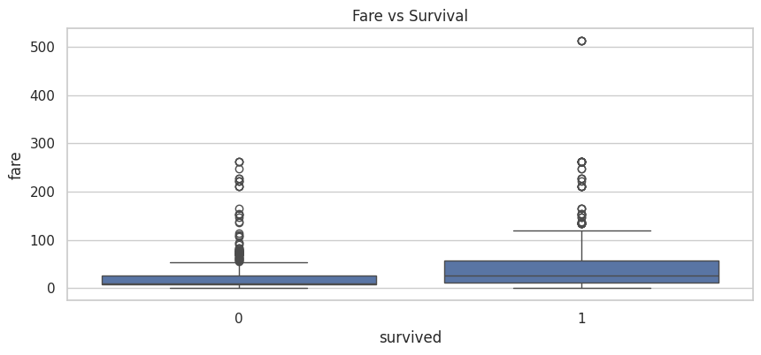

# KMeans Clustering Project


---

## 📌 Overview

This educational project showcases the application of the **KMeans Clustering algorithm** across three scenarios:

- 🧮 Manual implementation using NumPy — to understand how KMeans works under the hood  
- 🔍 Clustering 2D data using `scikit-learn`  
- 🚢 Titanic dataset analysis with real-world insights on passenger survival  

Whether you're a beginner learning unsupervised learning or a data science enthusiast, this project provides both conceptual clarity and practical depth.

---

## 🧠 Key Learning Outcomes

- Understand the math and logic behind KMeans
- Perform real-world data preprocessing and transformation
- Visualize clusters using PCA and interpret silhouette scores
- Analyze survival patterns using feature-based segmentation

---

## 📁 Project Structure

```
KMeans-Clustering-Project/
├── data/                  # Titanic dataset (Excel)
├── src/                   # Python scripts
├── images/                # Plots and visuals
├── analysis_report.txt    # Summary of insights
├── requirements.txt       # Dependencies
├── README.md              # Documentation
├── LICENSE                # MIT License
└── .gitignore
```

---

## 🚀 How to Run

```bash
# Install all required libraries
pip install -r requirements.txt

# Run the main script
python src/kmeans_clustering_project.py
```

📎 Make sure the `titanic.xls` dataset is placed inside the `data/` folder.

---

## 📊 Visual Insights

The project includes rich exploratory data analysis (EDA) before and after clustering:

- ✅ Survival distribution
- ✅ Age and Fare distribution
- ✅ Survival by gender and age group
- ✅ PCA 2D projection of clusters
- ✅ Cluster evaluation using silhouette score

---

## 🖼️ Sample Visual Outputs

| Description                        | Image Preview                     |
|-----------------------------------|-----------------------------------|
| Raw Data - Manual KMeans          |  |
| Manual KMeans Clustering Result   |  |
| Raw Data - Scikit-learn Example   |  |
| Sklearn KMeans Result             |  |
| Survival Distribution             |  |
| Age Distribution                  |  |
| Fare vs Survival                  |  |
| Survival by Gender                |  |
| Survival by Age Group             |  |

---

## 📄 License

This project is open-source under the [MIT License](LICENSE).

---

## 🤝 Contributions

Feel free to fork this repository, open issues, or submit pull requests to make it even better!
